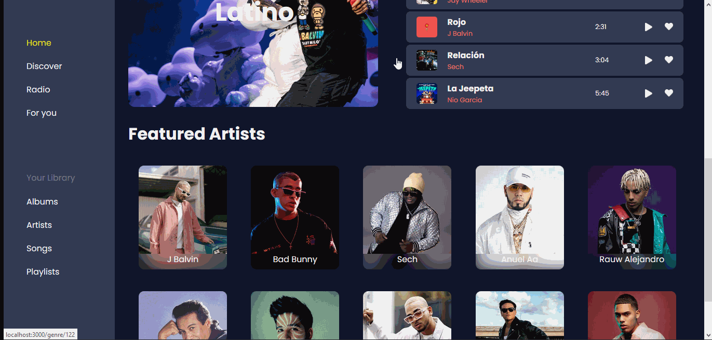
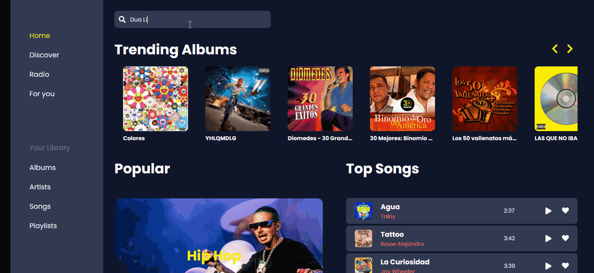
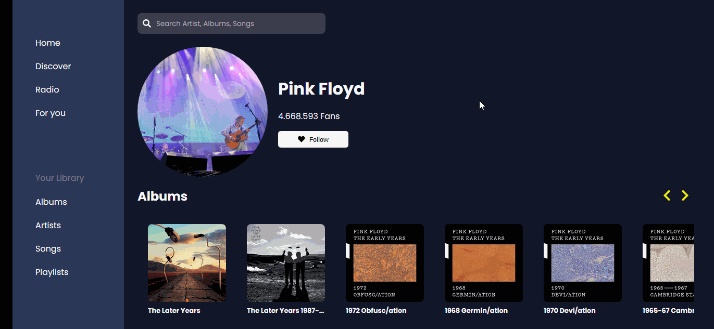
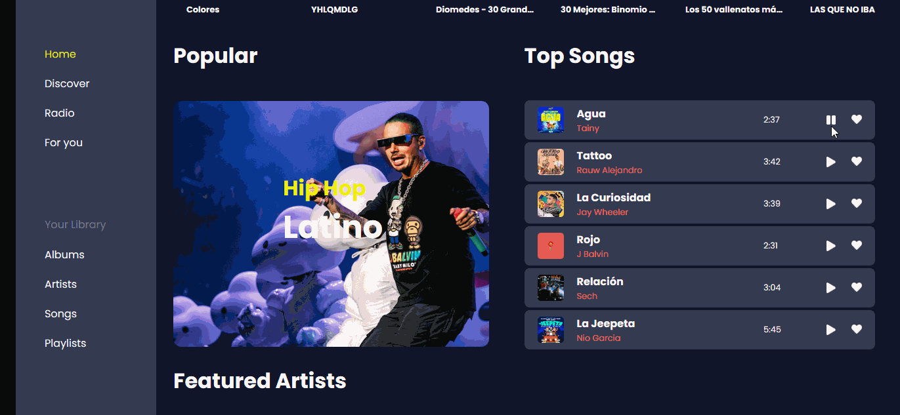
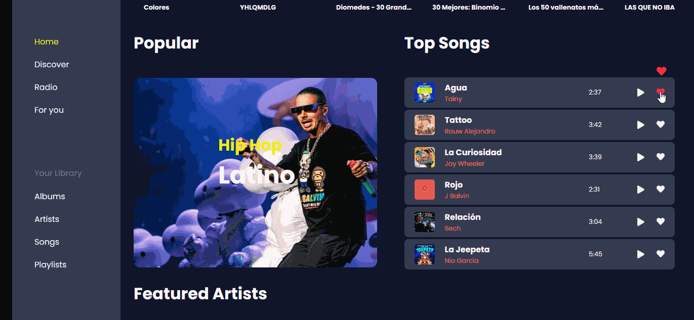
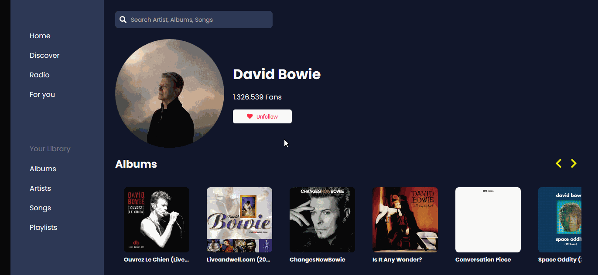

# Maoc Music

## Demo

Go to the demo [here](https://maocmusic.netlify.app) :computer:

## About the project

:student: This is a small project with the intention of learning the basic concepts of web development with react-redux.

It consists of a small music web application :musical_note:. Developed with the [API of Deezer](https://developers.deezer.com/api) to get the information.

## Main Features

**:top: You get the artists and albums highlighted at the time**

**:mag_right: You can search by artists, albums or songs**

**:singer: Each artist has a personalized profile with the information of their albums and most popular songs, and at the end a section of related artists**

**:arrow_forward: You can play a preview**

**You can add songs to favorites:heart: and playlists:minidisc: (:construction: this feature is in production)**

**:eye_speech_bubble: You can follow artists (:construction: this feature is in production)**

## Responsive Design

:iphone:

